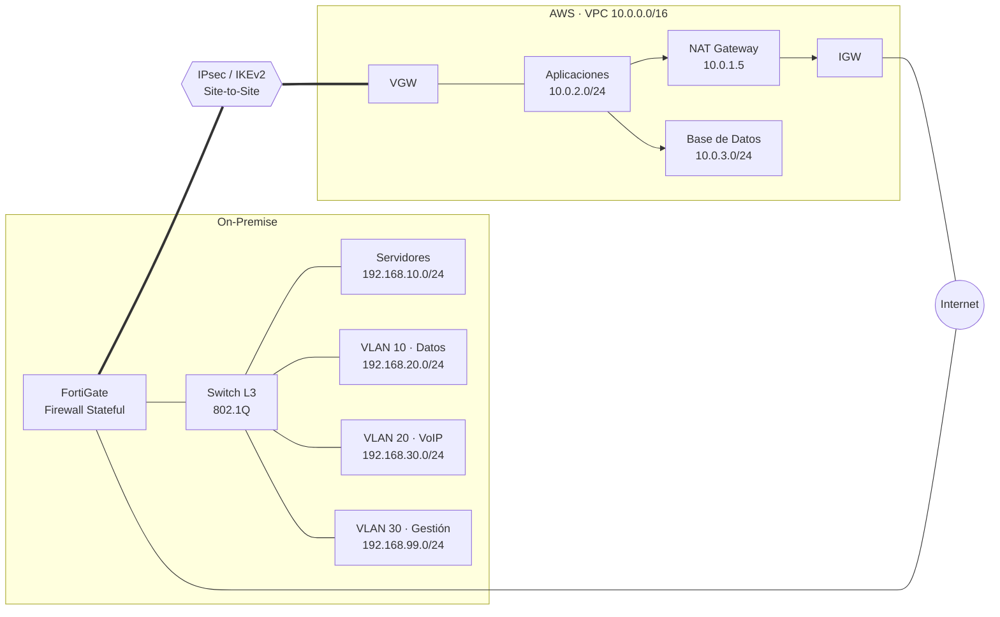

## Análisis de seguridad de una arquitectura de red corporativa híbrida
#### Seguridad en Redes - 2027-1
#### Dr. Gunnar Eyal Wolf Iszaevich

#### Alumno: Abraham Medina Varela

Establecemos la base tecnológica. Operamos desde una oficina rentada en el corredor corporativo Reforma-Insurgentes (CDMX), por lo que asumimos un entorno con elevada concentración de infraestructura de comunicaciones y dispositivos inalámbricos. Diseñamos la red para soportar correo, ERP y colaboración. Aislamos estaciones de trabajo y telefonía IP. Migramos infraestructura crítica hacia una nube pública para aprovechar recursos escalables. Separamos la lógica de aplicación y bases de datos del entorno local.

Implementamos dos redes principales *on-premise*. Asignamos `192.168.10.0/24` a servidores y `192.168.20.0/24` a estaciones de trabajo (VLAN 10). Configuramos el switch de distribución para gestionar las VLAN 20 (Telefonía IP, `192.168.30.0/24`) y 30 (Gestión, `192.168.99.0/24`). Ejecutamos el enrutamiento inter-VLAN directamente en el switch de capa 3 y establecemos la primera dirección de host (`.1`) como *gateway*. De esta forma, distribuimos las funciones de segmentación y enrutamiento interno sin depender exclusivamente del firewall perimetral.

Protegemos el perímetro local con un firewall *stateful* FortiGate. Concentramos la salida a Internet y terminamos el túnel VPN nube-local. Restringimos el uso de *trunking* IEEE 802.1Q a los enlaces que lo requieren y configuramos puertos de acceso para los dispositivos finales. Estas decisiones de configuración constituyen superficies de ataque relevantes para el análisis de capa 2.

Desplegamos una VPC (`10.0.0.0/16`) para la nube y la segmentamos en tres subredes. Ubicamos el NAT Gateway en la subred pública (`10.0.1.0/24`) y enrutamos hacia Internet mediante un Internet Gateway (IGW). Mantenemos los servidores de aplicación en una subred privada (`10.0.2.0/24`) y dirigimos su tráfico saliente por el NAT Gateway. Aislamos los nodos de bases de datos en otra subred privada (`10.0.3.0/24`) y restringimos su comunicación a los servidores de aplicaciones [10].

Establecemos conectividad inter-sitios mediante un túnel IPsec IKEv2. Terminamos la conexión en el Virtual Private Gateway (VGW) de la nube y el FortiGate local. Configuramos las tablas de rutas de la VPC para dirigir prefijos privados específicos a través de la VPN y evitar la exposición directa de los servicios internos a redes públicas [11].

Identificamos tres zonas críticas de análisis: red local segmentada, controles de conectividad VPC y túnel de interconexión. Analizaremos riesgos en las capas 2, 3 y 4 del modelo TCP/IP, abordando superficies concretas frente a amenazas tangibles.

## Análisis de Riesgos por Capa (TCP/IP)

Evaluamos vulnerabilidades en las capas 2, 3 y 4, y estimamos probabilidades analizando exposición, accesibilidad y topología.

### Capa de Enlace (Capa 2)

**Ataque 1: Envenenamiento ARP (ARP Spoofing)**

* **Descripción:** Falsificamos respuestas ARP [1]. Asociamos una dirección MAC maliciosa con la IP del gateway.
* **Superficie de ataque:** Dominio de broadcast local (`192.168.20.0/24`). Switch L3 responsable del enrutamiento.
* **Impacto (CIA):** Comprometemos confidencialidad e integridad. Facilitamos la intercepción activa del tráfico (*Man-in-the-Middle*).
* **Probabilidad:** Media. Requiere acceso a la red local o a un equipo dentro de la VLAN. No requiere comprometer administrativamente el switch.

**Ataque 2: Salto de VLAN (VLAN Hopping)**

* **Descripción:** Intentamos explotar una configuración vulnerable de los enlaces troncales, mediante negociación de *trunking*, como DTP, o *double tagging* de tramas `802.1Q`.
* **Superficie de ataque:** Enlaces troncales del switch. Fronteras lógicas entre las VLAN 10, 20 y 30.
* **Impacto (CIA):** Comprometemos confidencialidad e integridad. Rompemos el aislamiento de red y podemos alcanzar sistemas de telefonía o administración.
* **Probabilidad:** Baja-media. Depende de una configuración vulnerable de puertos de acceso o enlaces troncales y requiere acceso inicial a la red.

### Capa de Red (Capa 3)

**Ataque 1: Falsificación de IP (IP Spoofing)**

* **Descripción:** Modificamos la dirección IP de origen. Falsificamos el origen aparente del tráfico y dificultamos su atribución [4].
* **Superficie de ataque:** Perímetro del FortiGate. Interfaces de enrutamiento interno. Tráfico inter-sitios (VPN hacia VPC).
* **Impacto (CIA):** Puede comprometer la integridad de comunicaciones que confíen en la dirección de origen y dificulta la trazabilidad. También puede contribuir a ataques de denegación de servicio.
* **Probabilidad:** Media. La falsificación es técnicamente sencilla, aunque enfrenta restricciones de filtrado perimetral y validaciones de capas superiores.

**Ataque 2: Inundación ICMP (ICMP Flooding)**

* **Descripción:** Generamos grandes volúmenes de mensajes ICMP [2] para consumir ancho de banda y recursos de procesamiento.
* **Superficie de ataque:** Interfaz pública perimetral. Recursos expuestos hacia redes no confiables.
* **Impacto (CIA):** Degradamos o interrumpimos la disponibilidad. Podemos afectar la conectividad de servicios locales y recursos en la nube.
* **Probabilidad:** Media. Permite ejecución remota desde Internet, aunque su efectividad depende de la capacidad del enlace y de las mitigaciones perimetrales.

### Capa de Transporte (Capa 4)

**Ataque 1: Inundación TCP SYN (SYN Flood)**

* **Descripción:** Iniciamos conexiones TCP masivas sin completar el *three-way handshake* [6]. Agotamos recursos destinados a mantener conexiones pendientes y, potencialmente, la tabla de estados.
* **Superficie de ataque:** Servicios TCP públicos. Firewall *stateful* perimetral (FortiGate).
* **Impacto (CIA):** Degradamos la disponibilidad. Podemos bloquear conexiones legítimas hacia servicios locales o de la VPC.
* **Probabilidad:** Media-alta. No requiere autenticación previa y puede distribuirse desde múltiples redes externas.

**Ataque 2: Escaneo de Puertos Evasivo (Evasive Port Scanning)**

* **Descripción:** Ejecutamos exploración furtiva. Enviamos paquetes con combinaciones atípicas de banderas TCP (FIN, NULL, XMAS) o fragmentamos los paquetes para dificultar su identificación [3].
* **Superficie de ataque:** Direcciones públicas perimetrales. Servicios publicados en la nube (VPC).
* **Impacto (CIA):** Mantiene la tríada intacta inicialmente. Facilita el reconocimiento de servicios expuestos y prepara ataques posteriores.
* **Probabilidad:** Alta. Puede ejecutarse remotamente y requiere pocos privilegios, aunque su eficacia depende de la configuración del firewall y de los mecanismos de detección.

## Propuesta de Mitigaciones

**Mitigación 1: Envenenamiento ARP**

* **Capa:** 2 (Enlace).
* **Parámetros/Tecnología:** Habilitamos *Dynamic ARP Inspection* (DAI) y *DHCP Snooping* en el switch L3 [9]. Configuramos como *trusted* únicamente los puertos que transportan tráfico DHCP legítimo, mientras mantenemos los puertos de acceso como no confiables.
* **Impacto:** Descartamos respuestas ARP que no coincidan con los *bindings* conocidos, reduciendo la posibilidad de suplantar gateways o equipos dentro de la VLAN.
* **Responsable:** Administrador de Red (NetAdmin).

**Mitigación 2: Salto de VLAN**

* **Capa:** 2 (Enlace).
* **Parámetros/Tecnología:** Deshabilitamos DTP en los puertos de acceso y configuramos explícitamente los enlaces troncales. Asignamos los puertos finales mediante `switchport mode access` y restringimos las VLAN permitidas en cada *trunk*. Utilizamos una VLAN nativa no utilizada (ej. VLAN 999) y sin enrutamiento [7].
* **Impacto:** Reducimos las posibilidades de negociación no autorizada y de *Double Tagging*, preservando el aislamiento entre las VLAN 10, 20 y 30.
* **Responsable:** Administrador de Red (NetAdmin).

**Mitigación 3: Falsificación de IP**

* **Capa:** 3 (Red).
* **Parámetros/Tecnología:** Implementamos *Unicast Reverse Path Forwarding* (uRPF) donde la topología permita validación estricta del origen [5] y aplicamos filtrado anti-*spoofing* en el perímetro conforme a BCP 38 [4].
* **Impacto:** Descartamos paquetes cuyo origen resulte incompatible con la interfaz o ruta esperada, reduciendo la suplantación de direcciones y mejorando la trazabilidad del tráfico.
* **Responsable:** Ingeniero de Seguridad Perimetral (NetSec).

**Mitigación 4: Inundación ICMP**

* **Capa:** 3 (Red).
* **Parámetros/Tecnología:** Aplicamos *rate limiting* para ICMP en el firewall perimetral y permitimos únicamente los tipos necesarios para operación y diagnóstico [2]. Complementamos el control con mecanismos de protección frente a tráfico volumétrico cuando estén disponibles en el proveedor cloud.
* **Impacto:** Limitamos el consumo de ancho de banda y recursos causado por tráfico ICMP excesivo, manteniendo la funcionalidad necesaria para diagnóstico.
* **Responsable:** Ingeniero de Seguridad Perimetral (NetSec).

**Mitigación 5: Inundación TCP SYN**

* **Capa:** 4 (Transporte).
* **Parámetros/Tecnología:** Activamos mecanismos de protección mediante *SYN Cookies* y establecemos límites de conexiones semiabiertas por origen en los controles perimetrales [6].
* **Impacto:** Reducimos la cantidad de estado reservado para conexiones pendientes y protegemos los servicios frente al agotamiento de recursos durante una inundación SYN.
* **Responsable:** Operaciones de Seguridad (SecOps).

**Mitigación 6: Escaneo de Puertos Evasivo**

* **Capa:** 4 (Transporte).
* **Parámetros/Tecnología:** Reforzamos la inspección *stateful* y descartamos paquetes con combinaciones de banderas TCP no esperadas. Activamos firmas IPS para identificar técnicas de reconocimiento y aplicamos reglas *Default-Deny* en los *Security Groups* de AWS, permitiendo únicamente los puertos requeridos [12].
* **Impacto:** Reducimos la superficie expuesta y aumentamos la capacidad de detectar exploraciones evasivas, sin asumir que el escaneo puede eliminarse completamente.
* **Responsable:** Operaciones de Seguridad (SecOps) / Arquitecto Cloud.

## Riesgos Residuales

Asumimos la persistencia de amenazas tras aplicar las mitigaciones, y clasificamos los riesgos según su ámbito y proponemos acciones adicionales de contención.

* **Ámbito On-Premise (Compromiso de endpoints):**

  * **Riesgo:** Movimiento lateral desde estaciones comprometidas. Un atacante con presencia en la red interna puede aprovechar la conectividad entre segmentos y evadir controles exclusivamente perimetrales.
  * **Acción recomendada:** Desplegamos plataformas EDR (*Endpoint Detection and Response*) y avanzamos hacia un modelo de Zero Trust Network Access (ZTNA), limitando el acceso según identidad, dispositivo y contexto [14].

* **Ámbito Nube (Configuraciones erróneas):**

  * **Riesgo:** Exposición accidental por errores de configuración, modificaciones indebidas de *Security Groups* o privilegios excesivos en identidades cloud.
  * **Acción recomendada:** Automatizamos auditorías mediante herramientas CSPM (*Cloud Security Posture Management*), aplicamos políticas de IAM con mínimo privilegio y gestionamos la infraestructura mediante IaC (*Infrastructure as Code*) para reducir cambios manuales no controlados [13].

* **Ámbito Interconexión (Disponibilidad del enlace):**

  * **Riesgo:** Un ataque volumétrico contra la conectividad pública del FortiGate puede saturar el enlace utilizado por la VPN y afectar la comunicación con la VPC.
  * **Acción recomendada:** Incorporamos protección DDoS y filtrado aguas arriba mediante el ISP, además de evaluar redundancia de la conectividad para reducir la dependencia de un único enlace.

## VPN vs. Enlace Dedicado

Sustituir la VPN IPsec por un enlace dedicado, como AWS Direct Connect, modifica principalmente la superficie de exposición y las características de disponibilidad del enlace [15].

Con un enlace dedicado eliminamos la dependencia del tránsito de la VPN sobre Internet y reducimos la exposición directa del canal de interconexión a ataques dirigidos contra una interfaz pública. Sin embargo, el enlace no proporciona confidencialidad por sí mismo: la seguridad del tráfico sigue dependiendo de los controles de capa 2 y 3, así como de las políticas de acceso y segmentación.

En capa 2 podemos incorporar MACsec, cuando sea soportado por la infraestructura elegida, para proporcionar confidencialidad e integridad sobre el enlace [8]. En capa 3 mantenemos filtrado, segmentación y control de rutas, evitando interpretar el enlace dedicado como una relación de confianza absoluta.

Se incrementan los costos de operación y despliegue al depender de circuitos, equipamiento e infraestructura del proveedor. A cambio, podemos obtener un rendimiento y una latencia más predecibles y reducir la dependencia de Internet. La inversión resulta especialmente justificable cuando existen requisitos estrictos de rendimiento, disponibilidad, aislamiento o cumplimiento que superan las necesidades de una VPN sobre Internet.

## Referencias

1. Plummer, D. C. (1982). *An Ethernet Address Resolution Protocol: Or Converting Network Addresses to 48.bit Ethernet Address for Transmission on Ethernet Hardware*. RFC 826. Internet Engineering Task Force. [RFC 826 — RFC Editor](https://www.rfc-editor.org/rfc/rfc826)

2. Postel, J. (1981). *Internet Control Message Protocol*. RFC 792. Internet Engineering Task Force. [RFC 792 — RFC Editor](https://www.rfc-editor.org/rfc/rfc792)

3. Postel, J. (1981). *Transmission Control Protocol*. RFC 793. Internet Engineering Task Force. [RFC 793 — RFC Editor](https://www.rfc-editor.org/rfc/rfc793)

4. Ferguson, P., & Senie, D. (2000). *Network Ingress Filtering: Defeating Denial of Service Attacks which employ IP Source Address Spoofing*. RFC 2827. Internet Engineering Task Force. [RFC 2827 — RFC Editor](https://www.rfc-editor.org/rfc/rfc2827)

5. Baker, F., & Savola, P. (2004). *Ingress Filtering for Multihomed Networks*. RFC 3704. Internet Engineering Task Force. [RFC 3704 — RFC Editor](https://www.rfc-editor.org/rfc/rfc3704)

6. Eddy, W. (2007). *TCP SYN Flooding Attacks and Common Mitigations*. RFC 4987. Internet Engineering Task Force. [RFC 4987 — RFC Editor](https://www.rfc-editor.org/rfc/rfc4987)

7. IEEE. (2018). *IEEE Standard for Local and Metropolitan Area Networks—Bridges and Virtual Bridged Local Area Networks*. IEEE 802.1Q.

8. IEEE. (2018). *IEEE Standard for Local and Metropolitan Area Networks—Media Access Control (MAC) Security*. IEEE 802.1AE. [IEEE 802.1AE-2018 — IEEE Standards Association](https://standards.ieee.org/ieee/802.1AE/7154)

9. Cisco Systems. *Dynamic ARP Inspection*. Cisco Documentation. [Cisco — Dynamic ARP Inspection](https://www.cisco.com/c/en/us/td/docs/switches/lan/c9000/sec-crypto/fhs-sisf/fhs-and-sisf-configuration-guide/dynamic-arp-inspection.html)

10. Amazon Web Services. *Amazon VPC — Configure route tables; Internet gateways; NAT gateways*. AWS Documentation. [AWS VPC — Route Tables](https://docs.aws.amazon.com/vpc/latest/userguide/VPC_Route_Tables.html)

11. Amazon Web Services. *What is AWS Site-to-Site VPN?* AWS Documentation. [AWS Site-to-Site VPN](https://docs.aws.amazon.com/vpn/latest/s2svpn/VPC_VPN.html)

12. Amazon Web Services. *Control traffic to your AWS resources using security groups*. AWS Documentation. [AWS Security Groups](https://docs.aws.amazon.com/vpc/latest/userguide/vpc-security-groups.html)

13. Amazon Web Services. *Security best practices in IAM*. AWS Documentation. [AWS IAM Security Best Practices](https://docs.aws.amazon.com/IAM/latest/UserGuide/best-practices.html)

14. Rose, S., Borchert, O., Mitchell, S., & Connelly, S. (2020). *Zero Trust Architecture*. NIST Special Publication 800-207. National Institute of Standards and Technology. [NIST SP 800-207](https://csrc.nist.gov/pubs/sp/800/207/final)

15. Amazon Web Services. *Encryption in AWS Direct Connect*. AWS Documentation. [AWS Direct Connect — Encryption in Transit](https://docs.aws.amazon.com/directconnect/latest/UserGuide/encryption-in-transit.html)
