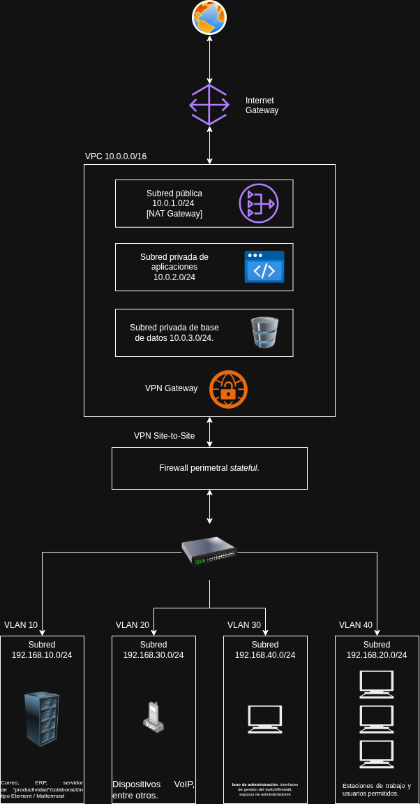

## Arquitectura de red

La Figura 1 muestra la arquitectura híbrida propuesta, incluyendo el entorno
on-premises, la segmentación mediante VLAN, la VPC y la interconexión mediante
VPN site-to-site.

## Por cada capa es necesario preguntarnos

1. ¿Qué elementos de nuestra arquitectura operan aquí?
2. ¿Qué elementos puede controlar el atacante?
3. ¿Qué propiedades asume o da por válidas el protocolo?
4. ¿Qué ataques podrían romper dichas propiedades?
5. ¿Cuáles realmente aplican al escenario analizado?

## Capa 2 — Enlace de datos

Las VLAN (Virtual Local Area Network) permiten segmentar lógicamente una red
Ethernet física en múltiples dominios de broadcast independientes. Aunque las
VLAN operan en la capa 2 del modelo OSI, normalmente cada una se asocia con una
subred IP diferente para permitir posteriormente el enrutamiento entre ellas.

En la arquitectura propuesta se utiliza un switch gestionable segmentado en
diferentes VLAN. Por ejemplo, la VLAN 40 contiene las estaciones de trabajo de
los usuarios.

Cuando dos dispositivos pertenecientes a la misma red necesitan comunicarse
mediante Ethernet, conocer únicamente la dirección IP del destino no es
suficiente. El dispositivo emisor necesita determinar también la dirección MAC
correspondiente. Para realizar esta resolución se utiliza ARP (Address
Resolution Protocol).

Un equipo que desconoce la dirección MAC asociada a una dirección IPv4 genera
una solicitud ARP en broadcast preguntando qué dispositivo posee dicha
dirección IP. El propietario de la dirección responde indicando su dirección
MAC.

ARP no incorpora mecanismos criptográficos para autenticar estas respuestas.
Por esta razón, un atacante dentro del mismo dominio de broadcast puede intentar
enviar respuestas ARP falsas y modificar las asociaciones IP-MAC almacenadas por
otros equipos. Este ataque se conoce como **ARP spoofing o ARP poisoning**.

Si el atacante logra asociar, por ejemplo, la dirección IP del gateway con su
propia dirección MAC, parte del tráfico de la víctima puede ser dirigido hacia
el atacante. Si posteriormente reenvía ese tráfico hacia el gateway legítimo,
puede establecer una posición de Man-in-the-Middle (MitM).

### Superficie de ataque

- Cualquier VLAN en la que atacante y víctima compartan el mismo dominio de
  broadcast.
- En esta arquitectura, la VLAN 40 correspondiente a estaciones de trabajo es
  una superficie especialmente relevante debido a la existencia de múltiples
  equipos de usuario.

### Prerrequisitos

- Acceso a un dispositivo conectado a la VLAN objetivo, ya sea mediante acceso
  físico o mediante el compromiso previo de una estación perteneciente a dicha
  VLAN.
- Capacidad de generar tráfico ARP dentro del dominio de broadcast.

### Impacto en CIA

- **Confidencialidad:** un atacante que consiga establecer una posición MitM
  podría observar tráfico que originalmente debía circular entre la víctima y
  el gateway. El impacto real dependerá también de mecanismos adicionales como
  TLS u otros sistemas de cifrado extremo a extremo.

- **Integridad:** mediante la falsificación de asociaciones IP-MAC se modifica
  información utilizada por los hosts para decidir hacia dónde enviar las
  tramas. Si además se establece una posición MitM, el atacante podría intentar
  modificar tráfico no protegido criptográficamente.

- **Disponibilidad:** si el atacante consigue que el tráfico de la víctima sea
  enviado hacia su equipo pero posteriormente no lo reenvía al destino
  legítimo, puede provocar una interrupción parcial o total de la comunicación.
  
  ### MAC Flooding / CAM Table Overflow

Los switches Ethernet mantienen una tabla de direcciones MAC, comúnmente
denominada tabla MAC o CAM (Content Addressable Memory), en la que relacionan
las direcciones MAC aprendidas con los puertos físicos por los cuales pueden
alcanzarse.

Por ejemplo, el switch puede mantener asociaciones similares a:

- MAC A → puerto 2
- MAC B → puerto 5
- MAC C → puerto 8

Esta información permite que una trama destinada a una dirección MAC conocida
sea enviada únicamente hacia el puerto correspondiente, evitando propagarla por
el resto de los puertos de la VLAN.

Un ataque de **MAC flooding** intenta generar una gran cantidad de tramas
Ethernet utilizando diferentes direcciones MAC de origen falsas. El objetivo es
forzar al switch a aprender una cantidad elevada de asociaciones y agotar o
degradar la capacidad de su tabla MAC.

Si una dirección MAC destino deja de estar disponible en dicha tabla, el switch
puede tratar la trama como un **unknown unicast** y propagarla hacia múltiples
puertos pertenecientes a la misma VLAN. Esto puede aumentar la exposición de
tráfico hacia dispositivos que normalmente no deberían recibirlo.

### Superficie de ataque

- Puertos de acceso del switch utilizados por estaciones de trabajo u otros
  dispositivos.
- VLAN en la cual se encuentre conectado el atacante.
- En la arquitectura propuesta, un equipo comprometido dentro de la VLAN 40
  podría utilizarse para intentar realizar este tipo de ataque contra el switch.

### Prerrequisitos

- Control de un dispositivo conectado físicamente a un puerto del switch.
- Capacidad de generar un gran número de tramas Ethernet utilizando diferentes
  direcciones MAC de origen.
- Ausencia o configuración insuficiente de mecanismos de protección en el
  switch.

### Impacto en CIA

- **Confidencialidad:** al provocar unknown unicast flooding, tráfico que
  normalmente sería enviado únicamente al puerto correspondiente podría llegar
  también a otros puertos pertenecientes a la misma VLAN, incrementando la
  posibilidad de observación de tráfico.

- **Integridad:** el ataque por sí mismo no modifica necesariamente la
  información transportada, por lo que su afectación directa sobre integridad
  es menor que en otros ataques de capa 2. Sin embargo, puede facilitar ataques
  adicionales si se combina con otras técnicas.

- **Disponibilidad:** la generación masiva de tramas y la degradación de la
  tabla MAC pueden incrementar la carga del switch y generar tráfico adicional
  dentro de la VLAN, afectando potencialmente el rendimiento de la red.
  
## Capa 3 — Red

En la capa 3 del modelo OSI se realiza el direccionamiento lógico y el
enrutamiento de paquetes entre redes diferentes. En la arquitectura propuesta,
esta capa interviene en la comunicación entre las distintas subredes
on-premises, el firewall perimetral, la VPN site-to-site y las subredes de la
VPC.

A diferencia de la capa 2, donde el reenvío depende principalmente de
direcciones MAC, en capa 3 los dispositivos toman decisiones utilizando
direcciones IP y tablas de enrutamiento.

### IP Spoofing

El encabezado IPv4 contiene una dirección IP de origen y una dirección IP de
destino. Sin embargo, IPv4 por sí mismo no incorpora un mecanismo criptográfico
que permita verificar que la dirección indicada como origen corresponde
realmente al dispositivo que generó el paquete.

Por esta razón, un atacante puede construir paquetes utilizando una dirección IP
de origen falsificada. Esta técnica se conoce como **IP spoofing**.

En la arquitectura propuesta, por ejemplo, un atacante que controle una estación
de la red `192.168.20.0/24` podría intentar generar paquetes indicando como
dirección de origen una perteneciente a la red de servidores
`192.168.10.0/24`.

Un paquete podría aparentar ser:

- Dirección real del atacante: `192.168.20.70`
- Dirección de origen falsificada: `192.168.10.25`
- Destino: `10.0.2.50`

Esto podría ser relevante si algún firewall, ACL o sistema remoto toma decisiones
de autorización únicamente basándose en la dirección IP de origen.

No obstante, la falsificación de una dirección IP presenta una limitación
importante: las respuestas generadas por el destino serán normalmente enviadas
hacia la dirección IP falsificada y no hacia la dirección real del atacante.
Por ello, IP spoofing no implica necesariamente que el atacante pueda establecer
una comunicación bidireccional completa.

Su utilidad puede encontrarse en ataques ciegos, evasión de controles mal
configurados, denegación de servicio o como componente de ataques de reflexión y
amplificación.

### Superficie de ataque

- Interfaces de capa 3 del firewall.
- Comunicación entre las diferentes subredes on-premises.
- Tráfico dirigido desde la red local hacia la VPC mediante la VPN site-to-site.
- Sistemas o reglas de filtrado que confíen excesivamente en la dirección IP de
  origen.

### Prerrequisitos

- Control de un dispositivo capaz de generar paquetes IP modificados.
- Existencia de controles de red que permitan el tránsito de paquetes con
  direcciones de origen incoherentes respecto a la interfaz por la que llegan.
- Para obtener un beneficio adicional, algún sistema debe confiar en la dirección
  IP de origen como elemento de autenticación o autorización.

### Impacto en CIA

- **Confidencialidad:** el impacto directo puede ser limitado, ya que las
  respuestas se enviarán normalmente hacia la dirección falsificada. Sin
  embargo, una configuración que otorgue acceso basándose únicamente en la IP de
  origen podría exponer información a ataques adicionales.

- **Integridad:** un atacante podría generar paquetes que aparenten proceder de
  otro sistema, afectando la confianza en la identidad lógica del origen y
  potencialmente provocando acciones no autorizadas en servicios que acepten
  este tipo de tráfico.

- **Disponibilidad:** la falsificación de direcciones IP puede utilizarse como
  parte de ataques de denegación de servicio, reflexión o generación de tráfico
  difícil de atribuir al verdadero origen.

### Probabilidad

En esta arquitectura la probabilidad puede considerarse **media-baja**, debido a
la existencia de un firewall stateful y a la segmentación de la red. Sin
embargo, la probabilidad aumentaría si no existen mecanismos de filtrado de
direcciones de origen, validación de rutas o controles que impidan recibir por
una interfaz paquetes que afirman pertenecer a otra red interna.

### ICMP Redirect Spoofing

ICMP (Internet Control Message Protocol) es utilizado por dispositivos de red
para comunicar información relacionada con el funcionamiento de IP, como
errores, diagnóstico o determinadas condiciones de enrutamiento.

Uno de sus tipos de mensaje es **ICMP Redirect**, cuyo propósito legítimo es
informar a un host de que existe un gateway más adecuado para alcanzar un
destino determinado.

Por ejemplo, una estación podría utilizar inicialmente su gateway
`192.168.20.1`. En determinadas circunstancias, un router puede indicarle que
para alcanzar cierto destino existe otro siguiente salto más apropiado.

El problema aparece si un atacante logra generar un mensaje ICMP Redirect falso
y el sistema operativo de la víctima lo acepta. El atacante podría intentar
modificar temporalmente la decisión de enrutamiento del host para que cierto
tráfico utilice como siguiente salto un equipo controlado por él.

Un escenario simplificado sería:

    Funcionamiento normal:

    Workstation
    192.168.20.50
          |
          v
    Gateway legítimo
    192.168.20.1

    Tras un ICMP Redirect falso:

    Workstation
    192.168.20.50
          |
          v
    Equipo atacante
    192.168.20.80
          |
          v
    Gateway legítimo
    192.168.20.1

Si el atacante reenvía posteriormente el tráfico hacia el gateway legítimo,
podría intentar situarse en el camino de comunicación. Si no lo reenvía, podría
provocar una interrupción del tráfico hacia determinados destinos.

Este ataque es distinto de ARP spoofing. En ARP spoofing se manipula la
asociación entre direcciones IP y MAC en capa 2, mientras que en ICMP Redirect
se intenta modificar una decisión de encaminamiento realizada en capa 3.

### Superficie de ataque

- Estaciones de trabajo pertenecientes a redes locales.
- Sistemas configurados para aceptar mensajes ICMP Redirect.
- Redes en las que un atacante pueda comunicarse directamente con la víctima.
- Hosts que utilicen un gateway IP susceptible de ser suplantado mediante
  mensajes ICMP falsificados.

Dentro de la arquitectura propuesta, las estaciones de trabajo de
`192.168.20.0/24` constituyen una superficie posible si sus sistemas operativos
aceptan este tipo de mensajes.

### Prerrequisitos

- Acceso a la red desde la cual sea posible alcanzar directamente a la víctima.
- Capacidad de generar mensajes ICMP manipulados.
- Que el sistema operativo de la víctima acepte ICMP Redirect.
- Ausencia de controles adicionales que filtren mensajes ICMP Redirect no
  autorizados.

### Impacto en CIA

- **Confidencialidad:** si el atacante logra introducirse en la ruta utilizada
  por la víctima, puede recibir tráfico que originalmente debía dirigirse
  directamente hacia el gateway legítimo. El contenido protegido mediante TLS,
  SSH u otros mecanismos criptográficos seguiría teniendo protección adicional.

- **Integridad:** el ataque modifica la información utilizada por el sistema para
  seleccionar su siguiente salto. Si además el atacante consigue actuar como
  intermediario, podría intentar modificar tráfico que no cuente con protección
  criptográfica extremo a extremo.

- **Disponibilidad:** un redirect malicioso puede conducir tráfico hacia un
  gateway inexistente o hacia un equipo que no reenvíe los paquetes, provocando
  pérdida parcial o total de conectividad hacia determinados destinos.

### Probabilidad

La probabilidad puede considerarse **baja o media**, dependiendo principalmente
de la configuración de los sistemas operativos. Muchos sistemas actuales
restringen o deshabilitan la aceptación de ICMP Redirect, lo cual reduce
considerablemente la viabilidad del ataque.

Sin embargo, en equipos mal configurados, sistemas antiguos o redes donde estos
mensajes se acepten sin controles suficientes, un atacante con presencia en la
red local podría intentar explotar este mecanismo.

## Capa 4 — Transporte

La capa de transporte proporciona mecanismos de comunicación extremo a extremo
entre aplicaciones. En la arquitectura analizada, los protocolos más relevantes
son TCP y UDP.

TCP es un protocolo orientado a conexión que mantiene estado y utiliza un
proceso de establecimiento de conexión antes de comenzar el intercambio normal
de datos. UDP, por otro lado, no establece una conexión previa y envía
datagramas sin mantener estado equivalente al de TCP.

Estas diferencias provocan que ambos protocolos presenten superficies de ataque
distintas, especialmente frente a ataques dirigidos a la disponibilidad de los
servicios.

### TCP SYN Flood

TCP utiliza un proceso conocido como three-way handshake para establecer una
conexión entre cliente y servidor:

1. El cliente envía un paquete SYN.
2. El servidor responde con SYN-ACK.
3. El cliente responde con ACK y la conexión queda establecida.

Cuando un servidor recibe el SYN inicial, debe mantener temporalmente información
relacionada con esa solicitud mientras espera que el cliente complete la
conexión.

Un ataque **TCP SYN Flood** consiste en generar una gran cantidad de solicitudes
SYN sin completar posteriormente el handshake. Esto puede provocar la
acumulación de conexiones incompletas o half-open connections y consumir los
recursos destinados a mantener solicitudes pendientes.

Si dichos recursos se agotan, clientes legítimos pueden experimentar retrasos o
ser incapaces de establecer nuevas conexiones.

En la arquitectura propuesta este ataque podría dirigirse contra servicios TCP,
por ejemplo servidores de correo, ERP, colaboración o aplicaciones desplegadas
en la VPC.

El firewall stateful constituye un control relevante, puesto que mantiene
información sobre el estado de las conexiones. Sin embargo, un volumen
suficientemente elevado de solicitudes también puede consumir recursos del
propio firewall o alcanzar servicios permitidos por sus reglas.

### Superficie de ataque

- Servicios TCP accesibles desde redes potencialmente hostiles.
- Servicios publicados hacia Internet en la VPC.
- Servidores internos alcanzables desde estaciones de trabajo comprometidas.
- Firewall stateful y otros dispositivos que mantengan tablas de conexiones.

En la arquitectura propuesta, cualquier servicio TCP autorizado por el firewall
o expuesto públicamente constituye una posible superficie de ataque.

### Prerrequisitos

- Capacidad de alcanzar el puerto TCP del servicio objetivo.
- Capacidad de generar múltiples solicitudes de establecimiento de conexión.
- Ausencia o insuficiencia de mecanismos destinados a limitar conexiones
  incompletas o grandes tasas de solicitudes.

A diferencia de determinados ataques de capa 2, el atacante no necesita
necesariamente pertenecer al mismo dominio de broadcast si el servicio es
alcanzable mediante IP.

### Impacto en CIA

- **Confidencialidad:** el ataque no tiene como finalidad principal acceder al
  contenido transmitido, por lo que el impacto directo sobre confidencialidad
  es reducido.

- **Integridad:** normalmente no modifica la información almacenada ni el
  contenido de las comunicaciones legítimas, por lo que su impacto directo
  sobre integridad también es limitado.

- **Disponibilidad:** constituye el impacto principal. La saturación de
  conexiones pendientes, recursos del servidor o tablas de estado de
  dispositivos intermedios puede impedir o degradar las conexiones de usuarios
  legítimos.

### Probabilidad

La probabilidad puede considerarse **media**, aunque depende de la exposición de
cada servicio.

Los servicios publicados hacia Internet presentan una mayor superficie de
ataque debido a que pueden recibir tráfico desde redes externas. Los servicios
internos presentan una probabilidad menor frente a atacantes externos, aunque
siguen siendo susceptibles si un dispositivo interno resulta comprometido.

La existencia de un firewall stateful reduce parte de la exposición, pero no
elimina por sí misma los ataques dirigidos contra servicios TCP legítimamente
publicados.

### Inundación UDP (UDP Flood)

UDP es un protocolo de transporte no orientado a conexión. A diferencia de TCP,
no utiliza un three-way handshake ni mantiene una conexión equivalente antes de
enviar información.

Un dispositivo puede transmitir datagramas UDP directamente hacia una dirección
IP y un puerto de destino.

Un ataque **UDP Flood** consiste en generar una cantidad elevada de datagramas
UDP dirigidos hacia uno o varios servicios de una víctima. El objetivo suele ser
consumir ancho de banda, capacidad de procesamiento o recursos de los
dispositivos encargados de recibir, filtrar o procesar dicho tráfico.

Cuando el tráfico se dirige hacia un servicio UDP existente, la aplicación debe
procesar los datagramas recibidos. Cuando se dirige hacia puertos en los que no
existe un servicio escuchando, el sistema puede realizar procesamiento
adicional y, dependiendo de su configuración, generar mensajes ICMP indicando
que el puerto no está disponible.

Un volumen suficientemente elevado puede degradar el funcionamiento del
servidor, del firewall o incluso del enlace de comunicación antes de que los
paquetes sean descartados.

En la arquitectura propuesta, este ataque sería especialmente relevante para
cualquier servicio UDP permitido por las políticas del firewall o desplegado en
la infraestructura on-premises o en la VPC.

### Superficie de ataque

- Servicios UDP publicados hacia Internet.
- Servicios UDP disponibles entre las diferentes redes internas.
- Interfaces públicas de la infraestructura en nube.
- Firewall y gateways encargados de procesar o filtrar tráfico UDP.
- Enlace de Internet o VPN si el volumen de tráfico es suficiente para consumir
  capacidad disponible.

### Prerrequisitos

- Capacidad de alcanzar la dirección IP de la infraestructura objetivo.
- Existencia de una ruta hacia la víctima.
- Que el tráfico UDP correspondiente no sea completamente filtrado antes de
  alcanzar el recurso que se pretende saturar.

El atacante no necesita establecer previamente una sesión, debido a que UDP no
es un protocolo orientado a conexión.

### Impacto en CIA

- **Confidencialidad:** el impacto directo es generalmente reducido, ya que el
  propósito principal de una inundación UDP no es obtener información.

- **Integridad:** tampoco constituye normalmente el objetivo principal, puesto
  que el ataque busca saturar recursos en lugar de modificar información.

- **Disponibilidad:** representa el impacto principal. El tráfico excesivo puede
  consumir ancho de banda, capacidad de procesamiento del servidor o recursos
  de los dispositivos de red, provocando degradación o indisponibilidad de los
  servicios.

### Probabilidad

La probabilidad puede considerarse **media** para servicios expuestos hacia
Internet y menor para servicios accesibles exclusivamente desde redes privadas.

La segmentación de red y las reglas del firewall reducen la superficie de
ataque, pero no necesariamente evitan una inundación dirigida contra un
servicio UDP que deba permanecer accesible.

Además, si el volumen de tráfico supera la capacidad del enlace de Internet, el
tráfico puede provocar afectaciones antes de que el firewall tenga oportunidad
de descartarlo.

## Riesgos residuales

La aplicación de controles de seguridad permite reducir de forma importante la
probabilidad y el impacto de los ataques analizados anteriormente. Sin embargo,
ninguna mitigación elimina por completo el riesgo.

Por esta razón, después de aplicar los controles propuestos permanecen riesgos
residuales asociados tanto al entorno on-premises como a la infraestructura en
nube y a la interconexión entre ambos entornos.

### Compromiso de un equipo interno

Aunque las VLAN, las reglas de firewall y los controles del switch reduzcan la
capacidad de movimiento dentro de la red, un equipo legítimo puede ser
comprometido mediante malware, robo de credenciales, vulnerabilidades de
software u otros mecanismos ajenos a los controles de red analizados.

Por ejemplo, una estación perteneciente a la VLAN 40 podría ser utilizada por un
atacante como punto inicial para generar tráfico malicioso desde una ubicación
que, desde el punto de vista de la infraestructura, parece legítima.

Este escenario es especialmente relevante debido a que algunas protecciones,
como el filtrado de tráfico externo, pierden efectividad cuando el ataque se
origina desde un dispositivo autorizado dentro de la organización.

**Ámbito afectado:** principalmente on-premises, aunque podría extenderse hacia
la nube mediante la VPN site-to-site.

**Afectaciones posibles:**

- Uso de un equipo legítimo para realizar reconocimiento interno.
- Intentos de acceso a otros segmentos de red.
- Generación de ataques de capa 2 dentro de su propia VLAN.
- Acceso a recursos de la VPC autorizados para las redes corporativas.
- Robo o utilización de credenciales almacenadas en el dispositivo.

**Acciones recomendadas:**

- Mantener actualizados sistemas operativos y aplicaciones.
- Implementar protección de endpoints y mecanismos de detección.
- Aplicar el principio de mínimo privilegio.
- Limitar mediante firewall el tráfico permitido entre VLANs.
- Evitar que la existencia de conectividad mediante VPN implique confianza total
  entre las redes on-premises y las redes de la VPC.
- Mantener registros centralizados que permitan detectar actividad anómala.

### Errores de configuración en la infraestructura de nube

La separación de la VPC en subred pública, aplicaciones privadas y base de
datos privada disminuye la exposición directa de los sistemas. Sin embargo,
esta protección depende de que las tablas de rutas, reglas de firewall, listas
de control de acceso y permisos de los servicios estén configurados
correctamente.

Una modificación accidental podría, por ejemplo, permitir tráfico hacia una
subred que originalmente debía permanecer aislada o crear una ruta excesivamente
permisiva entre el entorno on-premises y los servidores en nube.

Por ello, aunque la arquitectura lógica sea segura, la configuración constituye
un riesgo residual permanente.

**Ámbito afectado:** nube, con posible impacto sobre la interconexión con el
entorno on-premises.

**Afectaciones posibles:**

- Exposición accidental de servicios hacia Internet.
- Reglas excesivamente permisivas entre las subredes de aplicación y base de
  datos.
- Acceso innecesario desde redes on-premises hacia recursos sensibles.
- Modificación de rutas que altere la segmentación prevista.
- Mayor superficie de ataque debido a servicios publicados por error.

**Acciones recomendadas:**

- Aplicar políticas de mínimo privilegio en reglas de red.
- Revisar periódicamente tablas de rutas, reglas de firewall y controles de
  acceso.
- Utilizar infraestructura como código cuando sea posible para mantener cambios
  auditables y reproducibles.
- Mantener registro de modificaciones realizadas sobre la VPC.
- Separar las funciones administrativas y evitar modificaciones sin revisión.

### Compromiso de un extremo de la VPN site-to-site

La VPN site-to-site proporciona confidencialidad e integridad al tráfico que
circula entre la infraestructura on-premises y la VPC. Sin embargo, la
protección del túnel no implica que los dispositivos ubicados en sus extremos
sean confiables.

Si el firewall on-premises, el gateway de VPN o un sistema con acceso autorizado
a la VPN resulta comprometido, el atacante podría generar tráfico que atraviese
legítimamente el túnel cifrado.

En este caso, el cifrado protege el tráfico frente a terceros durante su
transporte, pero no protege a la infraestructura frente a un extremo ya
comprometido.

**Ámbito afectado:** interconexión, con posible propagación hacia on-premises y
nube.

**Afectaciones posibles:**

- Acceso no autorizado entre ambas infraestructuras.
- Movimiento lateral desde una red comprometida hacia la otra.
- Uso del túnel VPN para transportar tráfico malicioso aparentemente legítimo.
- Mayor impacto de un compromiso local debido a la existencia de conectividad
  entre ambos entornos.

**Acciones recomendadas:**

- Restringir mediante reglas explícitas qué subredes y servicios pueden utilizar
  la VPN.
- Evitar políticas del tipo "permitir todo" entre las redes corporativas y la
  VPC.
- Proteger y rotar las credenciales utilizadas para establecer la VPN.
- Mantener actualizados los gateways y equipos perimetrales.
- Supervisar el tráfico que atraviesa el túnel y generar alertas ante
  comportamientos anómalos.
  
## Sustitución de la VPN site-to-site por un enlace dedicado

Reemplazar la VPN site-to-site por un enlace dedicado modificaría de forma
importante la superficie de ataque y el modelo de confianza de la
interconexión entre la red on-premises y la VPC.

La principal diferencia es que el tráfico dejaría de atravesar directamente
Internet público como medio de transporte y pasaría a utilizar una
infraestructura privada proporcionada por un carrier o proveedor de nube.

### Cambios en la superficie de ataque

Con una VPN site-to-site, los gateways que establecen el túnel normalmente
disponen de interfaces alcanzables desde Internet. Esto introduce una
superficie de ataque asociada al propio servicio VPN, incluyendo escaneo de
puertos, intentos de explotación del gateway, ataques de denegación de servicio
y posibles vulnerabilidades en la implementación del protocolo.

Al utilizar un enlace dedicado, esta exposición pública puede reducirse de
forma considerable, debido a que la comunicación entre ambos entornos ya no
dependería directamente de un endpoint VPN accesible desde Internet.

Sin embargo, el riesgo no desaparece. Parte de la confianza se desplaza hacia
el proveedor del enlace, su infraestructura física, sus equipos de routing y
los dispositivos utilizados para entregar el servicio.

### Conclusión

La sustitución de la VPN por un enlace dedicado no elimina el riesgo, sino que
modifica su naturaleza.

Se reduce la exposición asociada a Internet público, pero aumentan la
dependencia del proveedor, la importancia de las políticas de routing y la
necesidad de garantizar redundancia física y lógica.

Por esta razón, un enlace dedicado debe considerarse como un cambio en el
modelo de confianza y no como un reemplazo de los controles de seguridad ya
existentes.

## Referencias

[1] IEEE, *IEEE Standard for Local and Metropolitan Area Networks—Bridges
and Bridged Networks*, IEEE Std 802.1Q-2022, Dec. 2022.

[2] D. C. Plummer, “An Ethernet Address Resolution Protocol: Or Converting
Network Protocol Addresses to 48.bit Ethernet Address for Transmission on
Ethernet Hardware,” RFC 826, Nov. 1982.

[3] J. Postel, “Internet Protocol,” RFC 791, Sep. 1981.

[4] J. Postel, “Internet Control Message Protocol,” RFC 792, Sep. 1981.

[5] R. Braden, Ed., “Requirements for Internet Hosts—Communication Layers,”
RFC 1122, Oct. 1989.

[6] W. Eddy, Ed., “Transmission Control Protocol (TCP),” RFC 9293,
Aug. 2022.

[7] W. Eddy, “TCP SYN Flooding Attacks and Common Mitigations,” RFC 4987,
Aug. 2007.

[8] J. Postel, “User Datagram Protocol,” RFC 768, Aug. 1980.

[9] P. Ferguson and D. Senie, “Network Ingress Filtering: Defeating Denial
of Service Attacks which employ IP Source Address Spoofing,” RFC 2827,
BCP 38, May 2000.

[10] F. Baker and P. Savola, “Ingress Filtering for Multihomed Networks,”
RFC 3704, BCP 84, Mar. 2004.

[11] S. Kent and K. Seo, “Security Architecture for the Internet Protocol,”
RFC 4301, Dec. 2005.

[12] E. Barker, Q. Dang, S. Frankel, K. Scarfone, and P. Wouters,
*Guide to IPsec VPNs*, NIST Special Publication 800-77 Rev. 1,
National Institute of Standards and Technology, Jun. 2020.

[13] K. Scarfone and P. Hoffman, *Guidelines on Firewalls and Firewall
Policy*, NIST Special Publication 800-41 Rev. 1, National Institute of
Standards and Technology, Sep. 2009.

[14] Cisco Systems, “Port Security,” *Security Configuration Guide,
Cisco IOS Release 15.2(7)E, Catalyst 2960-L Switches*, Cisco Systems.
